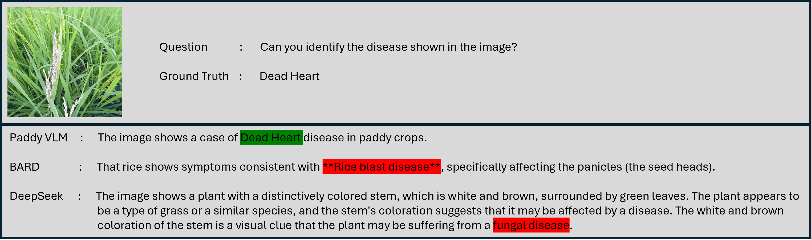
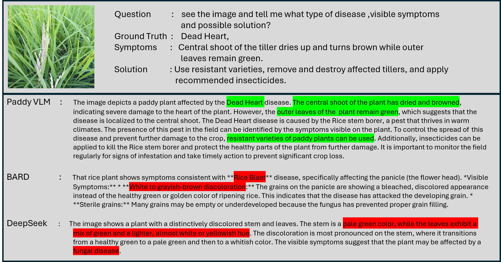
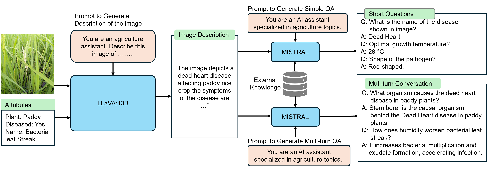

# 🌾 Paddy-VLM
<p align="justify">
Large multimodal models (LMMs) have demonstrated impressive capabilities in vision-language reasoning, yet they often struggle when applied to specialized domains such as agriculture. Crop disease diagnosis, in particular, demands fine-grained expertise that general-purpose LMMs fail to capture. In this work, we present PaddyVLM, a domain-adapted vision-language model designed for paddydisease analysis. Building on LLaVA-v1.5-7B-LoRA, we construct PaddyInstruct, a domain-specific instruction-tuning dataset derived from a curated Paddy Disease dataset of 10,407 images spanning 10 categories, including both healthy and diseased conditions. To develop PaddyInstruct, we generate image descriptions with LLaVA-13B, create Q&A pairs and multi-turn dialogues using Mistral-7B (via an Ollama setup), and enrich them with knowledge from agricultural repositories. Fine-tuning with this data enables PaddyVLM to not only recognize diseases with high accuracy but also assess severity and provide actionable recommendations in conversational form. Experimental results demonstrate that PaddyVLM substantially outperforms general-purpose multimodal models in fine-grained recognition and domain-specific reasoning, positioning it as a promising expert assistant for farmers and agricultural researchers. This repository contains code, resources, and instructions to reproduce the experiments and fine-tune the model.  
</p>

---

## Comparison of PaddyVLM with other open source models  


  
<!--

<p align="center">
  
</p>

<p align="center">
  
</p> -->
# Step to construct PaddyInstruct, instruction-tuning dataset derived from image only Paddy Disease dataset
Download or Clone this repo (git clone https://github.com/samy101/paddy-vlm.git). Project folder PaddyVLM contains two python notebook, datasets folder and other_resources zip file.


### 1. Ollama Setup for linux

run the below command in terminal to install the ollama
```
curl -fsSL https://ollama.com/install.sh | sh
```
Run the below command to download the mistral and llava:13b model
```
ollama run llava:13b
ollama run mistral
```
please visit the official website [ollama.com](https://ollama.com/) to see the installation for Windows and macOS.

Make sure your system meets the requirements before proceeding. You should have at least 8 GB of RAM available to run the 7B models, 16 GB to run the 13B models, and 32 GB to run the 33B models.

## 2. Dataset

1. Click the below link and download the dataset from Kaggle:  
   👉 [Paddy Disease Classification Dataset](https://www.kaggle.com/competitions/paddy-disease-classification/data)
   
rename the train_images folder to paddy_disease and copy this folder inside datasets folder in PaddyVLM

datasets folder will look like following structure:

```
datasets/
 └── paddy_disease/
      ├── blast/
      ├── tungro/
      ├── dead_heart/
      ├── brown_spot/
      ├── hispa/
      ├── bacterial_leaf_blight/
      └── healthy/

```

---

## 3. Other Resources
   Extract the other_resources that contains attribute and external_knowledge folder copy the other_resources folder and paste inside paddyVLM folder.

   It will look like this
```
other_resource/
├── attributes/
│ └── paddy_disease/
│ ├───── blast/
│ ├───── tungro/
│ ├───── dead_heart/
│ └── ...
└── external_resource/
└── paddy_disease/
├───── blast/
├───── tungro/
├───── dead_heart/
└── ...

```

Run the data_generation.ipynb it will generate "paddy_disease.jsonl" file that will contain the question-answer pair. Now run the data_format_converter.ipynb that will 
convert it into llava finetuning format and generate "paddy_disease_llava.json". Please croos-verify the files name.

---

# Model Fine-tuning
Please see the official documentation [LLaVA Official Repository](https://github.com/haotian-liu/LLaVA) for more details or follow the below steps.

Important: Only Linux is supported. For macOS/Windows, follow instructions in the LLaVA repo.
```
# Clone the LLaVA repository
git clone https://github.com/haotian-liu/LLaVA.git
cd LLaVA

# Create and activate environment
conda create -n llava python=3.10 -y
conda activate llava

# Install dependencies
pip install --upgrade pip
pip install -e .
pip install -e ".[train]"
pip install flash-attn --no-build-isolation

# (Optional) If upgrading:
git pull
pip install -e .

# If errors occur, try:
# pip install flash-attn --no-build-isolation --no-cache-dir
```
copy the dataset folder and paddy_disease_llava.json inside the playground folder and run the below command in terminal 
```
bash scripts/v1_5/finetune_task_lora.sh
```
Please adjust the below file path inside scripts/v1_5/finetune_task_lora.sh if needed
--data_path ./playground/data/llava_v1_5_mix665k.json \
--image_folder ./playground/data/dataset
```
✅ Done!

References
- [LLaVA Official Repository](https://github.com/haotian-liu/LLaVA)
- [Ollama](https://ollama.com/)
- [Kaggle Dataset](https://www.kaggle.com/competitions/paddy-disease-classification/data)
