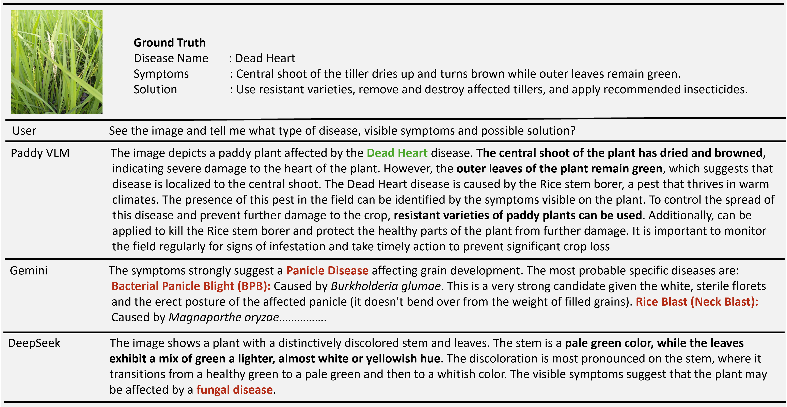

# 🌾 Paddy-VLM
<p align="justify">
Paddy is one of the most important crops worldwide, but its
cultivation suffers significant yield losses due to diseases and
pests that are often difficult to accurately identify and man-
age. Existing models are largely limited to image classifica-
tion or detection and lack the contextual agricultural knowl-
edge required for reliable diagnosis and effective mitigation.
We present PaddyVLM, a domain-adapted vision-language
model for paddy crop analysis, capable of identifying dis-
eases and pests, assessing severity, and providing action-
able guidance. Built on LLaVA-v1.5-7B-LoRA, our model
is trained using PaddyInstruct, a curated instruction-tuning
dataset derived from the Paddy Doctor (10,407 images, 10
classes) and Paddy Pest (5,673 images, 20 classes) datasets.
PaddyInstruct combines LLaVA-13B generated descriptions,
Mistral-7B generated simple Q&A and multi-turn dialogues,
and expert knowledge refinement. Fine-tuning on this dataset
equips PaddyVLM with robust fine-grained recognition and
context-aware reasoning. Experiments show that PaddyVLM
substantially outperforms general-purpose LMMs in both dis-
ease and pest understanding, demonstrating its potential as
a practical expert assistant for farmers and agricultural re-
searchers.  
</p>

---

## Comparison of PaddyVLM with other open source models  


  
<!--

<p align="center">
  
</p>

<p align="center">
  
</p> -->
# Step to construct PaddyInstruct, instruction-tuning dataset derived from image only Paddy Disease dataset
Download or Clone this repo (git clone https://github.com/samy101/paddy-vlm.git). Project folder PaddyVLM contains two python notebook, datasets folder and other_resources zip file.


### 1. Ollama Setup for linux

run the below command in terminal to install the ollama
```
curl -fsSL https://ollama.com/install.sh | sh
```
Run the below command to download the mistral and llava:13b model
```
ollama run llava:13b
ollama run mistral
```
please visit the official website [ollama.com](https://ollama.com/) to see the installation for Windows and macOS.

Make sure your system meets the requirements before proceeding. You should have at least 8 GB of RAM available to run the 7B models, 16 GB to run the 13B models, and 32 GB to run the 33B models.

## 2. Dataset

1. Click the below link and download the dataset from Kaggle:  
   👉 [Paddy Disease Classification Dataset](https://www.kaggle.com/competitions/paddy-disease-classification/data)
   
rename the train_images folder to paddy_disease and copy this folder inside datasets folder in PaddyVLM

datasets folder will look like following structure:

```
datasets/
 └── paddy_disease/
      ├── blast/
      ├── tungro/
      ├── dead_heart/
      ├── brown_spot/
      ├── hispa/
      ├── bacterial_leaf_blight/
      └── healthy/

```

---

## 3. Other Resources
   Extract the other_resources that contains attribute and external_knowledge folder copy the other_resources folder and paste inside paddyVLM folder.

   It will look like this
```
other_resource/
├── attributes/
│ └── paddy_disease/
│ ├───── blast/
│ ├───── tungro/
│ ├───── dead_heart/
│ └── ...
└── external_resource/
└── paddy_disease/
├───── blast/
├───── tungro/
├───── dead_heart/
└── ...

```

Run the data_generation.ipynb it will generate "paddy_disease.jsonl" file that will contain the question-answer pair. Now run the data_format_converter.ipynb that will 
convert it into llava finetuning format and generate "paddy_disease_llava.json". Please croos-verify the files name.

---

# Model Fine-tuning
Please see the official documentation [LLaVA Official Repository](https://github.com/haotian-liu/LLaVA) for more details or follow the below steps.

Important: Only Linux is supported. For macOS/Windows, follow instructions in the LLaVA repo.
```
# Clone the LLaVA repository
git clone https://github.com/haotian-liu/LLaVA.git
cd LLaVA

# Create and activate environment
conda create -n llava python=3.10 -y
conda activate llava

# Install dependencies
pip install --upgrade pip
pip install -e .
pip install -e ".[train]"
pip install flash-attn --no-build-isolation

# (Optional) If upgrading:
git pull
pip install -e .

# If errors occur, try:
# pip install flash-attn --no-build-isolation --no-cache-dir
```
copy the dataset folder and paddy_disease_llava.json inside the playground folder and run the below command in terminal 
```
bash scripts/v1_5/finetune_task_lora.sh
```
Please adjust the below file path inside scripts/v1_5/finetune_task_lora.sh if needed
--data_path ./playground/data/llava_v1_5_mix665k.json \
--image_folder ./playground/data/dataset
```
✅ Done!

References
- [LLaVA Official Repository](https://github.com/haotian-liu/LLaVA)
- [Ollama](https://ollama.com/)
- [Kaggle Dataset](https://www.kaggle.com/competitions/paddy-disease-classification/data)
